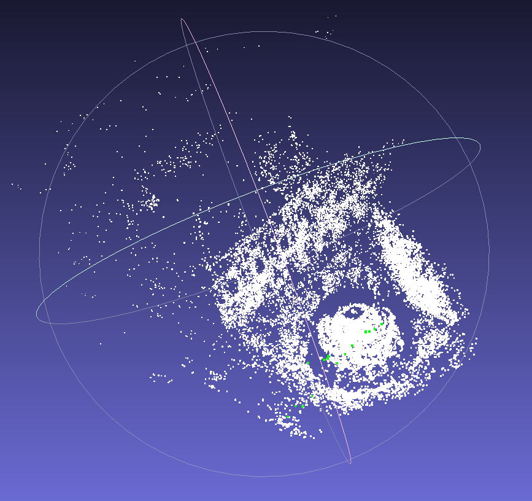
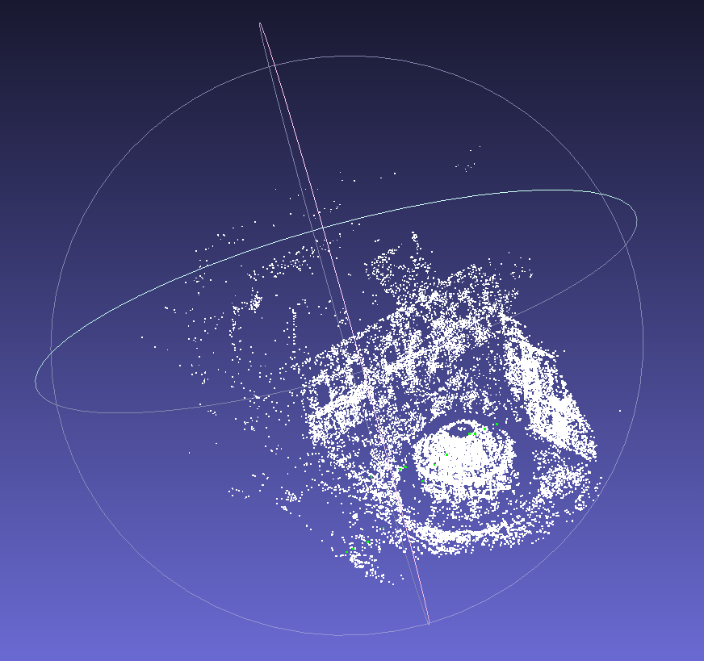

# optimization_related_practices
## ceres_curve_fitting
Fitting curve $y = 3x^2+2x+1$.

```bash
iter      cost      cost_change  |gradient|   |step|    tr_ratio  tr_radius  ls_iter  iter_time  total_time
   0  9.549396e+05    0.00e+00    6.28e+05   0.00e+00   0.00e+00  1.00e+04        0    3.55e-03    5.89e-03
   1  5.103274e+01    9.55e+05    6.24e+01   0.00e+00   1.00e+00  3.00e+04        1    5.02e-03    1.11e-02
   2  5.101183e+01    2.09e-02    4.66e-03   2.27e-02   1.00e+00  9.00e+04        1    3.47e-03    1.46e-02
Ceres Solver Report: Iterations: 3, Initial cost: 9.549396e+05, Final cost: 5.101183e+01, Termination: CONVERGENCE
Initial a: 0, b: 0, c: 0
Final   a: 3.00106, b: 2.03023, c: 1.03467
```

## ceres_bundle_adjustment
### dataset ([problem-16-22106-pre.txt](http://grail.cs.washington.edu/projects/bal/dubrovnik.html))
```xml
<num_cameras> <num_points> <num_observations>
<camera_index> <point_index> <observation_1_x> <observation_1_y>
...
<camera_index> <point_index> <observation_num_observations_x> <observation_num_observations_y>
<camera_1_parameters>
...
<camera_num_cameras_parameters>
<point_1_x>
<point_1_y>
<point_1_z>
...
<point_num_points_x>
<point_num_points_y>
<point_num_points_z>
```
Each camera consists of a set of nine parameters, which are R, t, f, k1, and k2.

### cost function
Project the 3D feature points onto 2D pixels in the camera images, then compute the reprojection error by comparing the observed pixel coordinates with the predicted coordinates.

$$
\sum_{i = 1}^n ||p_c-(-\frac{1}{Z}KTp_w)||^2
$$

Find the camera parameters and the 3D feature points that minimize the cost function.

### result
<p align="center">
  
&nbsp; &nbsp; &nbsp; &nbsp;
  
</p>